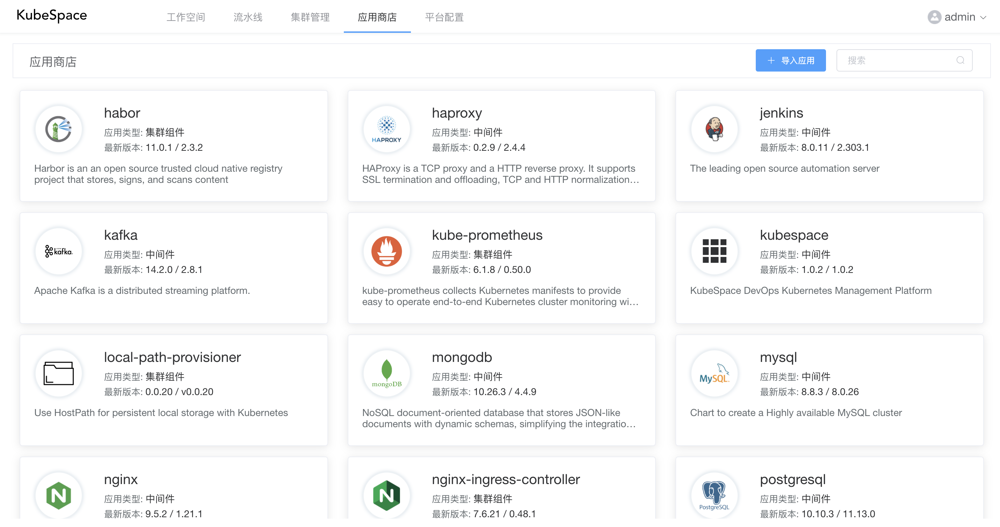
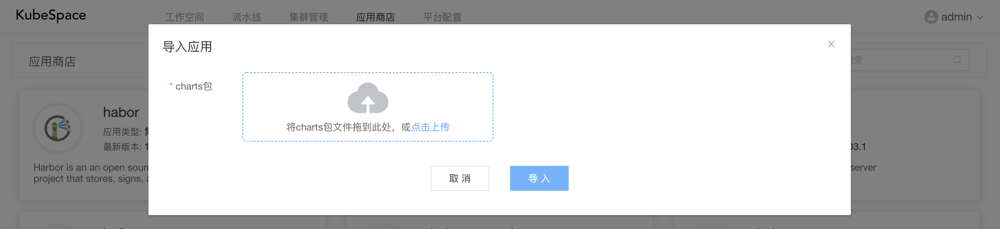
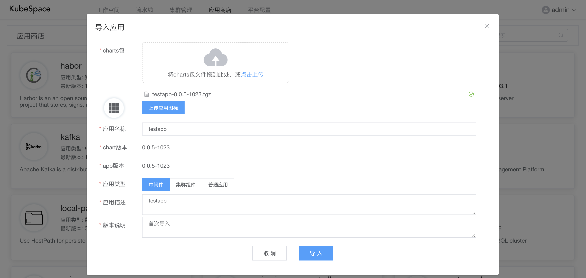

# 应用商店

KubeSpace平台的应用商店内置了丰富的中间件（如mysql、redis等）以及集群组件。来快速支持您的业务部署。

应用商店中的应用底层是通过[Helm Chart](https://helm.sh/docs/chart_template_guide/getting_started/)来实现的。当然，若内置的不满足需求，可以导入自定义应用。

点击每个应用，可以查看该应用的版本列表。

### 导入应用

点击「导入应用」，可以在应用商店导入自定义应用。

将helm chart包上传之后，会读取该chart包中的应用信息。

填写完「应用描述」以及「版本说明」之后，点击「导入」按钮即可导入。

导入完成之后，可以在工作空间中的应用进行导入，并安装部署。