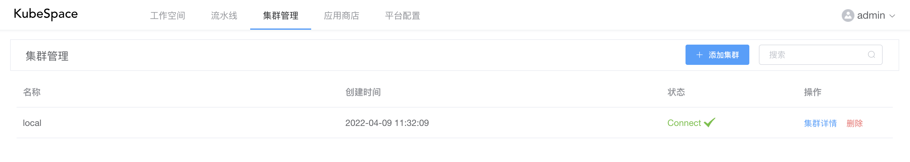
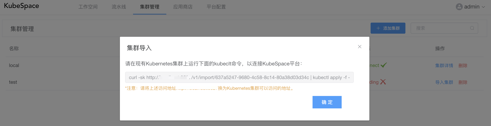
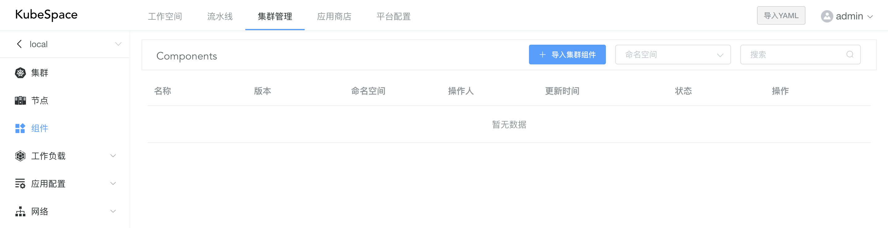
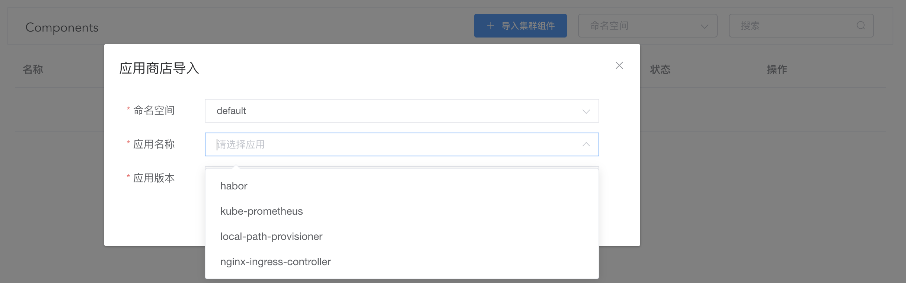
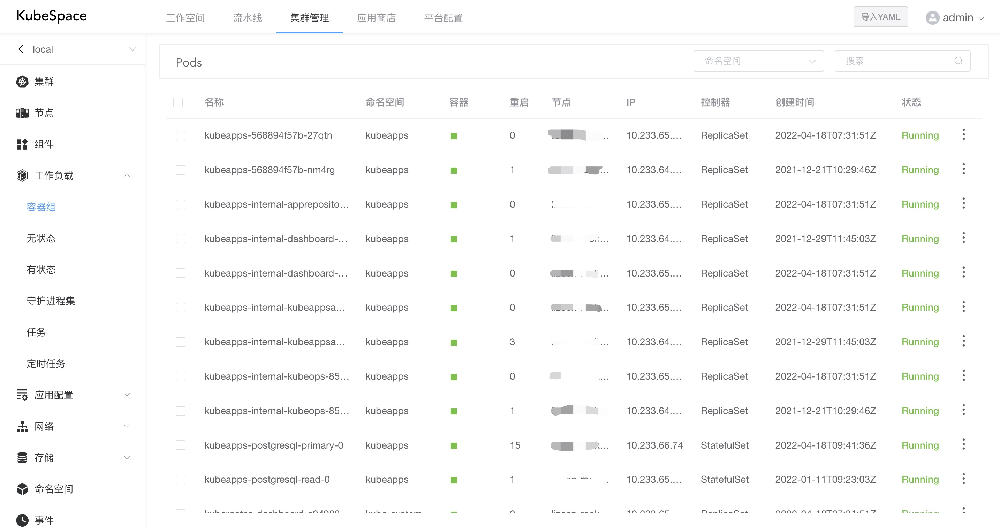
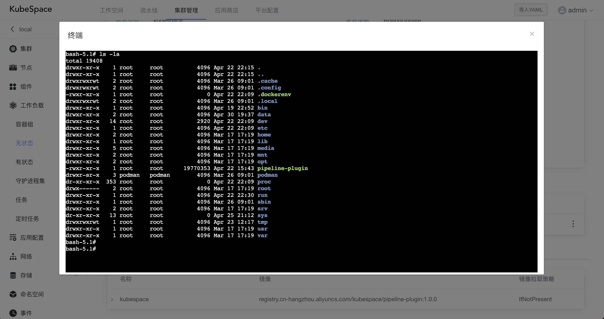

# 集群管理

### 导入集群

首次登录之后，默认会将当前集群添加到平台。

您还可以添加其它集群到平台，点击「添加集群」，输入集群名称，集群添加之后，会提示将Kubernetes集群导入连接到KubeSpace平台。

在Kubernetes集群中使用上述的kubectl命令部署agent服务，将集群连接导入到KubeSpace平台。

等待几分钟后，查看agent服务是否启动。

> kubectl get pods -n kubespace

可以看到agent服务的pod已经是Running状态，在KubeSpace平台可以看到集群状态为Connect。

### 集群管理

将Kubernetes集群成功连接导入到KubeSpace平台之后，就可以统一管理集群中的资源了。

### 集群组件

导入集群之后，可以在集群中导入应用商店中的集群组件，比如harbor、kube-prometheus等。

点击「导入集群组件」，在弹出框中选择要导入的命名空间、组件以及对应版本。

### 工作负载

  在KubebSpace平台，可以很容易的对集群中工作负载如Pod、Deployment、StatefulSet等进行管理。

同时，可以对Pod中的容器进行日志查看以及终端执行命令。

