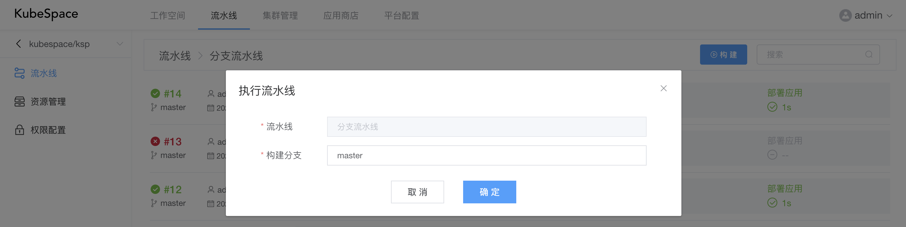
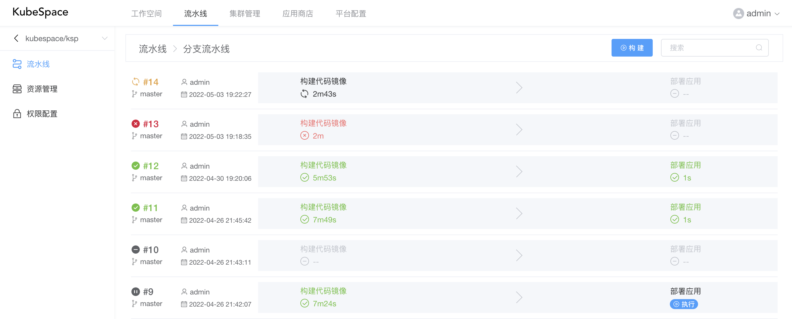
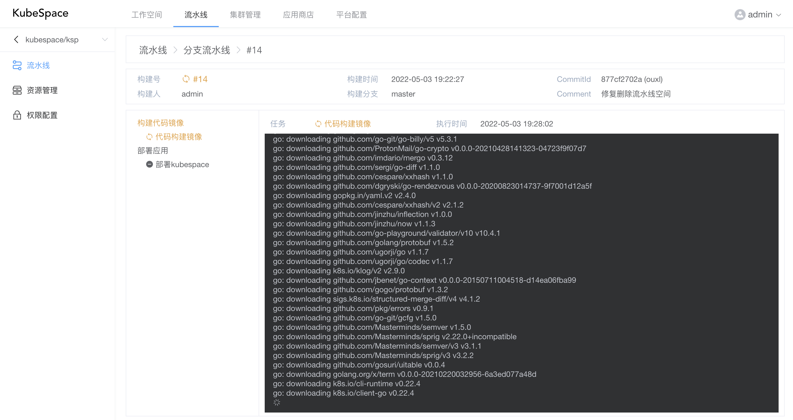
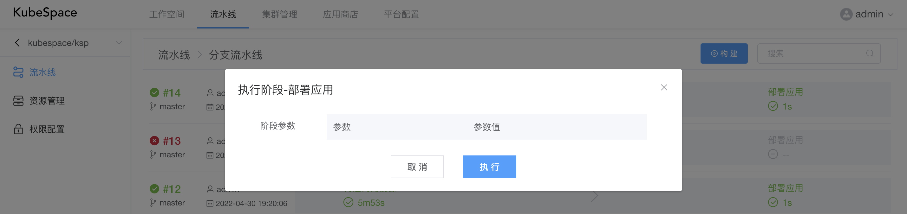
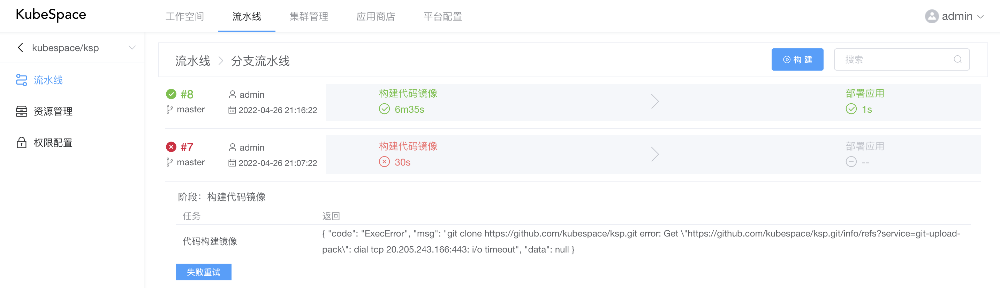

# 构建流水线

### 构建

在流水线创建/编辑完成之后，可以对该流水线进行构建。

在构建列表中，点击「构建」按钮，会弹出构建框，输入代码库分支，进行构建。

点击「确定」之后，会生成一个新的构建号，拉取代码库该分支最新提交Commit Id，执行该流水线。

在执行过程中，可以点击「#构建号」，实时查看构建时的日志以及任务状态。

### 手动执行

当阶段触发配置为「手动触发」时，在流水线执行到该阶段时，会暂停执行，需要点击「执行」按钮。

在执行时，如果配置阶段参数，可以修改参数值。

### 失败重试

当流水线中的某个任务执行失败后，可以重试该阶段，重新执行。

