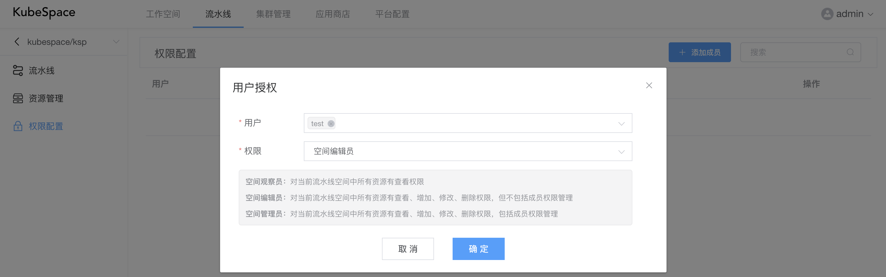
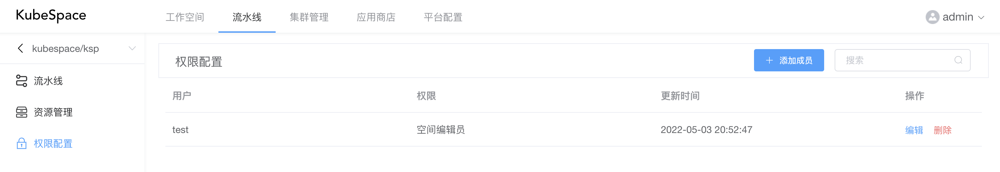

# 权限配置

在工作空间中，可以对该工作空间中的成员进行权限管理。包括如下权限：

- 空间观察员：对当前流水线空间中所有资源有查看权限；
- 空间编辑员：对当前流水线空间中所有资源有查看、增加、修改、删除权限，但不包括成员权限管理；
- 空间管理员：对当前流水线空间中所有资源有查看、增加、修改、删除权限，包括成员权限管理。

可以同时添加多个用户对该流水线空间的权限配置。

在对用户授权完成之后，可以在列表中看到该流水线空间所有成员以及对应权限。

