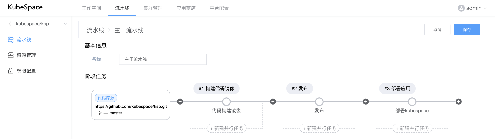
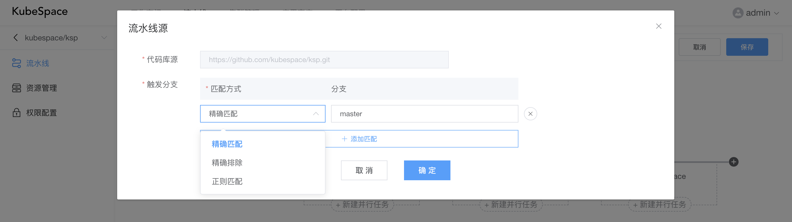
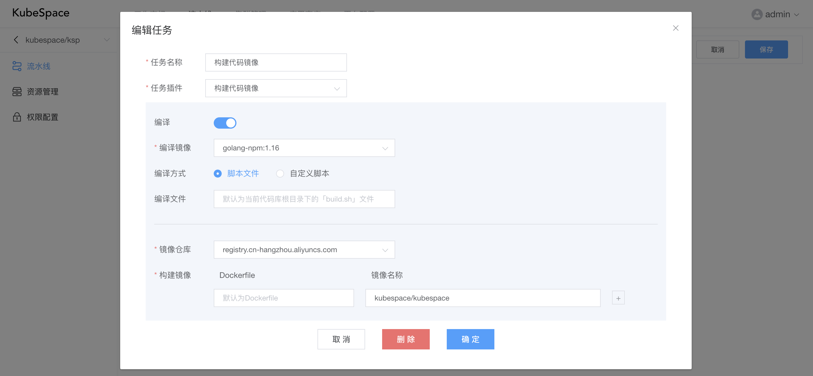
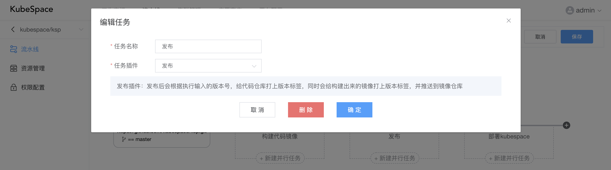
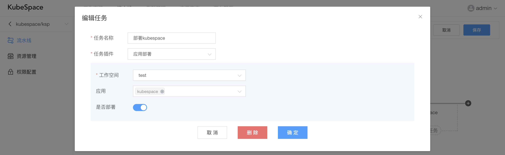
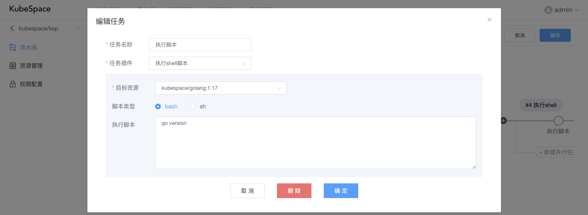
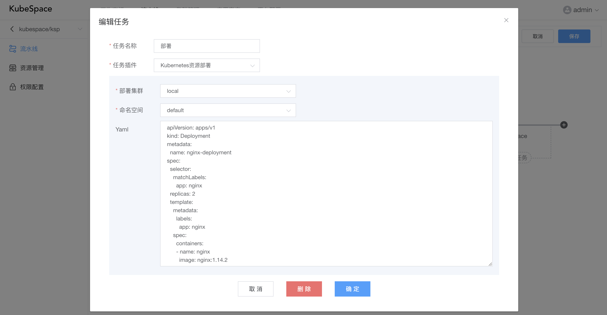

# 代码流水线

在创建完代码空间后，会自动创建两条流水线，即「分支流水线」以及「主干流水线」。在两条流水线中都默认包括一个「构建代码镜像」的阶段任务，但是在主干流水线中会多一个「发布」的阶段任务。

### 编辑流水线

在流水线列表，点击「编辑」，可以对流水线中的阶段任务进行配置。

其中，

- 代码库源：该流水线对应的代码库，以及构建该流水线的分支条件；
- 阶段：流水线可以添加多个阶段，每个阶段可以添加多个并行执行的任务；
- 任务：每个任务对应一个流水线插件，用于执行不同具体的任务；

### 代码库源

点击「代码库源」，可以配置构建该流水线的分支条件：

匹配方式包括：

- 精确匹配：即完全与分支的名称相同才可以构建执行该流水线；
- 精确排除：即只要不是该分支，都可以构建执行该流水线；
- 正则匹配：即正则匹配对应的分支，都可以构建执行该流水线。

### 阶段配置

点击「+」或阶段，可以添加/编辑阶段：

其中，可以选择触发方式，

- 自动触发：构建执行流水线后，该阶段会自动执行；
- 手动触发：构建执行流水线后，当执行到该阶段时，会停止执行，等待用户手动执行。

还可以手动配置阶段执行的参数。

### 任务配置

点击「新建并行任务」或任务，可以对具体的任务进行配置：

每个任务可以选择具体的任务插件，并填写该插件的配置。当前包括如下任务插件：

#### 构建代码镜像

构建代码镜像，包括如下几个步骤：

1. 编译：选择对应的编译镜像，以及编译方式，默认为执行代码库中根目录下的「build.sh」，还可以自定义脚本，在该编译镜像中执行编译脚本之后，生成编译结果，执行时会将代码库挂载到编译镜像中的/app目录；
2. 构建镜像：选择对应的镜像仓库，若没有镜像仓库，可以在「平台配置->镜像仓库」进行添加，并填写对应的Dockerfile相对代码库的目录文件，以及对应要构建的镜像名称，在编译之后，会执行docker build进行构建镜像；
3. 推送镜像：构建镜像成功之后，会执行docker push将镜像推送到镜像仓库，所以在添加镜像仓库时，确保对应的用户、密码填写正确，否则会推送失败。

#### 发布

如上图，发布插件不需要任何配置，但是在执行任务时，会要求输入发布版本号，执行后会给代码仓库打上版本标签，同时会给构建出来的镜像打上版本标签，并推送到镜像仓库。

#### 应用部署

应用部署包括如下步骤：

1. 将构建或发布的镜像，替换应用中的镜像，特别注意，替换逻辑为：应用中的容器镜像与构建出来的镜像剔除仓库与标签后，完全相同；

2. 根据配置「是否部署」，替换完成之后，如打开部署，

   - 若应用未安装，则会执行「安装」操作；

   - 若应用已安装，则会执行「升级」操作，将应用进行升级。

#### 执行shell脚本

执行脚本可以指定「目标资源」（镜像以及主机），在目标资源中执行shell脚本。可以在流水线空间的「资源管理」中对镜像/主机进行管理。

#### Kubernetes资源部署

Kubernetes资源部署包括如下步骤：

1. 替换Yaml中工作负载类型（Pod、Deployment、StatefulSet、DaemonSet、CronJob、Job）中的镜像，其中替换逻辑与「应用部署」插件一致；
2. 镜像替换之后，会将Yaml资源部署到对应集群中的命名空间下。
