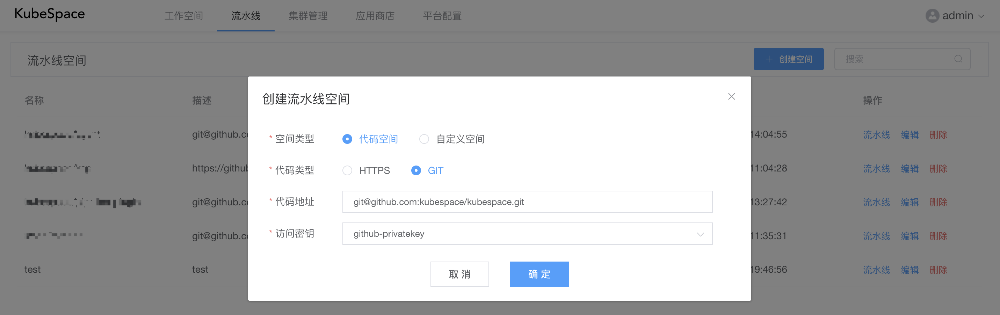
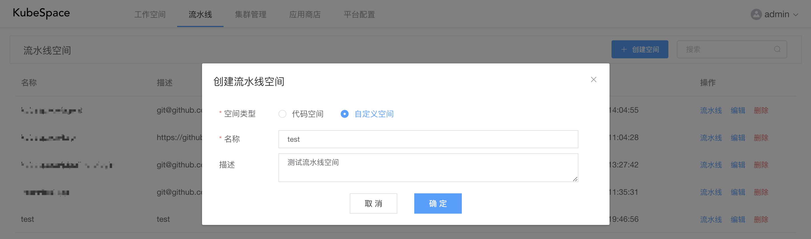
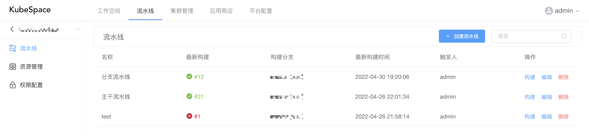

# 流水线空间

流水线空间是包含一组流水线的逻辑概念。其中流水线空间包括两种类型：

- 代码空间：以代码库为触发源，可以针对不同分支进行构建流水线；
- 自定义空间：以代码库流水线为触发源，可以组合多个流水线来进行构建部署。

### 创建流水线空间

点击上方导航栏中的「流水线」，并点击「创建空间」

其中，

- 空间类型：包括代码空间以及自定义空间；
- 代码类型：包括HTTPS以及GIT两种，不同类型对应的访问密钥不同；
- 代码地址：对应代码类型的代码库地址；
- 访问密钥：选择对应代码库的访问密钥，若没有访问密钥，可以在「平台配置->密钥管理」中进行添加。

若选择「自定义空间」类型，只需要输入名称即可。

在创建完成「代码流水线空间」之后，会默认创建「分支流水线」以及「主干流水线」两个流水线。您可以再创建自己的自定义流水线进行构建。

