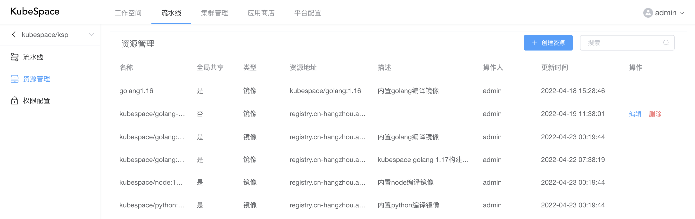
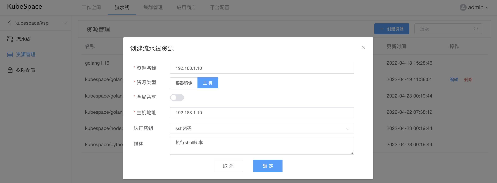

# 资源管理

在流水线空间中，可以添加镜像/主机资源，在编译或执行shell脚本时使用。

默认KubeSpace平台会内置一些镜像资源，如python、node、golang等，当前不可以对内置的镜像资源镜像修改删掉操作。

### 创建资源

点击「创建资源」按钮，在弹出框中填写镜像/主机信息：

其中：

- 资源名称：该流水线资源的名称；
- 资源类型：镜像或者主机类型；
- 全局共享：该资源是否对整个平台的所有流水线空间都可以使用；
- 镜像地址/主机地址：资源的镜像地址或主机地址；
- 认证密钥：主机认证的用户密码；
- 描述：该资源的简单描述。