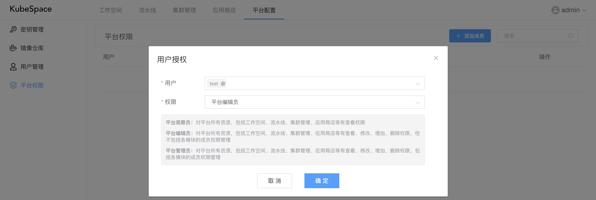
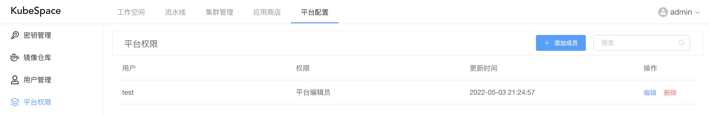

# 平台权限

在平台配置中，可以将平台中权限授权给用户。包括如下权限：

- 平台观察员：对平台所有资源，包括工作空间、流水线、集群管理、应用商店等有查看权限；
- 平台编辑员：对平台所有资源，包括工作空间、流水线、集群管理、应用商店等有查看、修改、增加、删除权限，但不包括各模块的成员权限管理；
- 平台管理员：对平台所有资源，包括工作空间、流水线、集群管理、应用商店等有查看、修改、增加、删除权限，包括各模块的成员权限管理。

可以同时添加多个用户对平台进行权限配置。

在对用户授权完成之后，可以在列表中看到具有平台权限的所有成员以及对应权限。

