# KubeSpace之应用管理

[KubeSpace](https://kubespace.cn)是一个DevOps以及Kubernetes多集群管理平台。

### 准备

##### Golang服务

现在我们有一个很简单的golang http服务，代码托管在[github](https://github.com/lzeen/go-app)。

本地启动golang服务，端口为8000：

```
go run main.go
```

请求http://127.0.0.1:8000/current_time返回当前时间：

```
curl http://127.0.0.1:8000/current_time
Hello, current time: 2022-05-08 11:11:33.632898 +0800 CST m=+18.871691849
```

##### 构建镜像

编译golang代码：

```
CGO_ENABLED=0 LD_FLAGS=-s GOOS=linux go build -o go-app
```

在代码库中有Dockerfile，构建服务镜像，并推送到镜像仓库

```
docker build -t registry.cn-hangzhou.aliyuncs.com/librrary/go-app:v1 .
docker push registry.cn-hangzhou.aliyuncs.com/librrary/go-app:v1
```

在装有docker的服务器运行镜像

```
docker run -it --rm -p 8000:8000 registry.cn-hangzhou.aliyuncs.com/librrary/go-app:v1
```

### 创建应用

在KubeSpace平台创建应用非常简单。

##### 创建一个测试环境

首先，创建一个工作空间「测试环境-1」，工作空间绑定一个K8s集群中的命名空间，通过命名空间来隔离不同环境的资源。

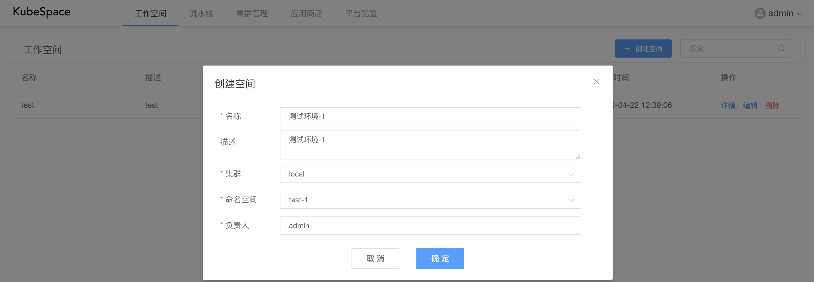

如上，「测试环境-1」绑定 local 集群中的 test-1 命名空间。

##### 创建go-app应用

进入到「测试环境-1」工作空间，进入「应用管理」，点击「创建应用」按钮。

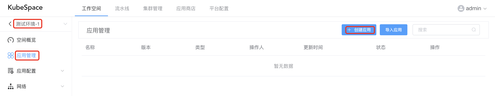

创建应用分为「基本信息」跟「应用配置」两部分。

在基本信息输入如下：

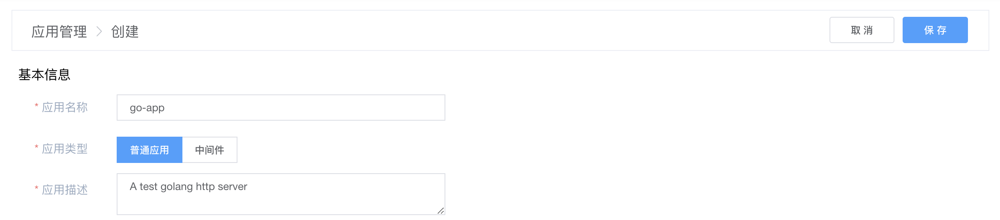

在应用配置中只需要输入镜像即可：

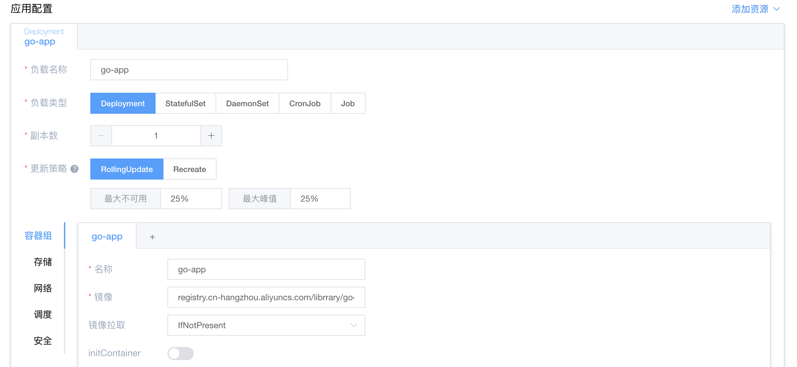

其它配置还包括：

- 容器组：可以添加多个容器，容器中包括镜像、启动命令、资源配额等配置；
- 存储：添加外部存储到工作负载，并挂载到容器中，包括PVC、HostPath、EmptyDir、ConfigMap、Secret、NFS、GlusterFS等；
- 网络：配置DNS策略，是否使用宿主机网络、PID，以及自定义域名等；
- 调度：工作负载的调度策略，包括指定节点标签、污点容忍、节点亲和性以及Pod亲和反亲和等；
- 安全：可以对工作负载中的容器限制用户运行以及sysctl配置等。

在右上角点击「保存」按钮，会保存当前应用配置为一个新的版本：

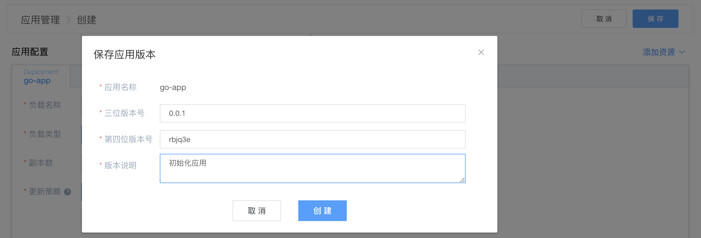

至此，一个go-app的应用创建成功。

### 安装应用

go-app应用创建成功之后，在应用列表可以进行安装。

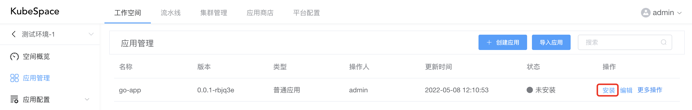

点击「安装」之后，还可以选择「应用版本」以及对「应用镜像」、「镜像标签」进行修改。

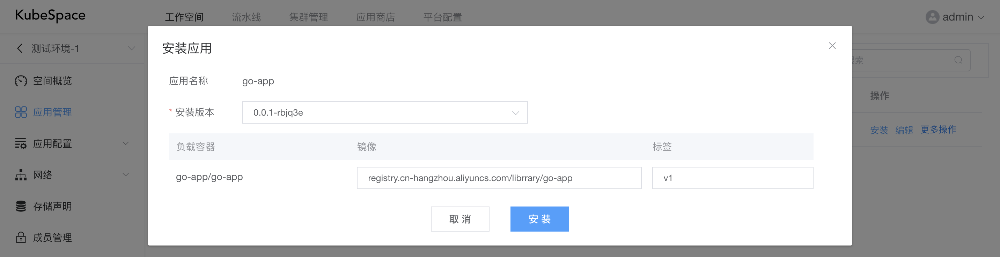

安装之后，在列表页点击「应用名称」，可以查看应用的资源详情、容器日志、进入容器Shell等。

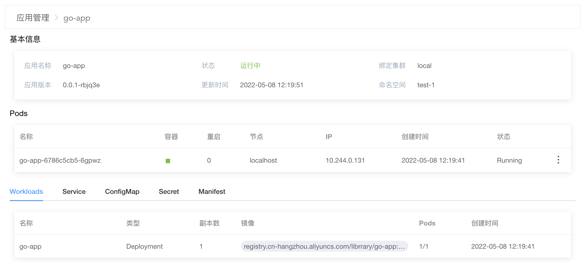

可以看到，go-app的Pod已经运行正常，访问Pod IP，看服务是否正常：

```
curl http://10.244.0.131:8000/current_time
Hello, current time: 2022-05-08 04:23:22.316105117 +0000 UTC m=+219.645432028
```

### 对外访问

现在，我们已经有一个在K8s集群内运行的go-app服务了。但是集群外部访问不到，可以通过以下两种方式：

- Service NodePort
- Ingress

##### 添加Service

在应用列表中，点击「编辑」go-app应用，添加应用端口以及Service。

如下，go-app应用容器配置中添加8000端口。

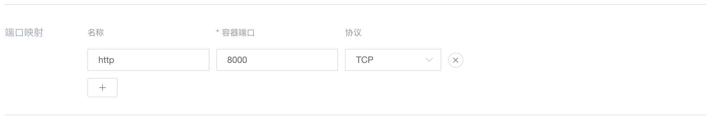

如下，首先添加Service资源，并选择Service类型为NodePort，点击「+ 添加服务端口」，其中NodePort为「30080」。

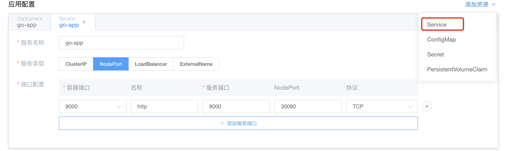

配置好Service之后，右上角点击「保存」，会对go-app应用配置生成一个新的版本，其中版本号修改为「0.0.2」。

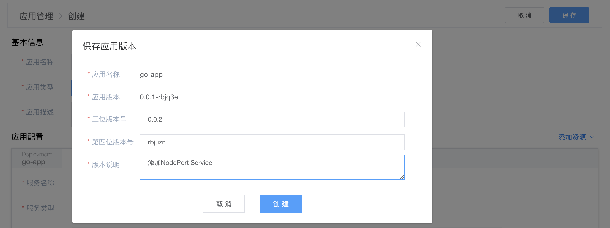

创建新的版本之后，在应用列表页，可以对go-app进行升级，版本选择「0.0.2-xxxxxx」。

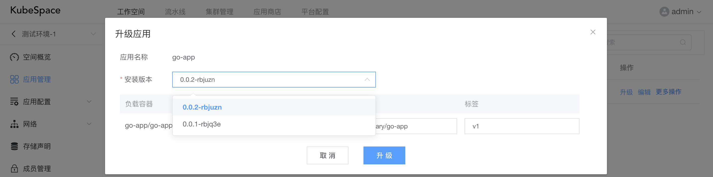

go-app升级之后，在集群外访问集群内任意一台机器的30080端口。

如下，其中10.240.163.1为宿主机ip地址：

```
curl http://10.240.163.1:30080/current_time
Hello, current time: 2022-05-08 06:03:30.467495512 +0000 UTC m=+57.204330272
```

##### 配置Ingress

配置Ingress前，请确保您的集群中已安装了IngressController，具体请参考https://kubernetes.io/zh/docs/concepts/services-networking/ingress-controllers/。

在「测试环境-1」工作空间中，点击左侧导航栏「网络」-「路由」，点击「创建」。

如下，添加Host为「go-app」的路由规则，并配置后端服务为我们之前创建的go-app Service，端口为「8000」。

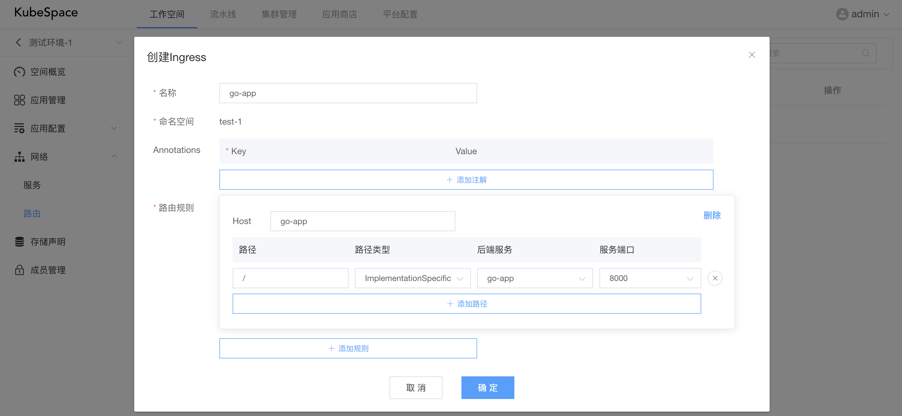

创建Ingress之后，我们可以在集群外的本地hosts配置域名，并通过域名访问。

```
echo '10.240.163.1 go-app' >> /etc/hosts
curl http://go-app/current_time
Hello, current time: 2022-05-08 06:03:30.467495512 +0000 UTC m=+57.204330272
```

### 克隆

现在我们已经在「测试环境-1」中初始化创建了go-app应用并正常安装运行了，那么可以在该环境进行测试。

这时，go-app有一个新的功能开发完成要进行测试，增加了**/v2/current_time**接口，将返回时间进行了更好的格式化显示。

```
curl http://127.0.0.1:8000/v2/current_time
Hello, current time: 2022-05-08 16:16:21
```

并构建了新的镜像：`registry.cn-hangzhou.aliyuncs.com/librrary/go-app:v2`

但是「测试环境-1」还需要测试其他功能，那么我们可以创建一个新的环境「测试环境-2」，绑定新的命名空间。

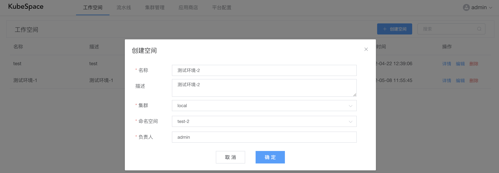

创建完成之后，我们可以在「测试环境-1」中，将应用**克隆**到「测试环境-2」中，快速初始化新的环境，并安装运行。

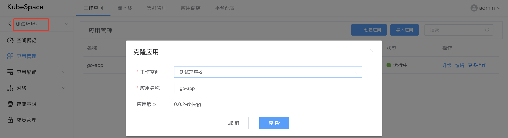

在「测试环境-2」中，对go-app进行安装，将镜像标签从「v1」修改为「v2」。

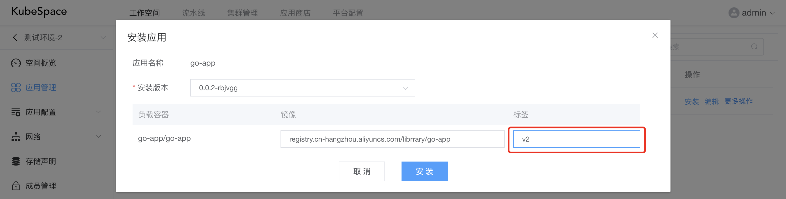

但是安装时，会报错如下，提示30080的端口已被分配：

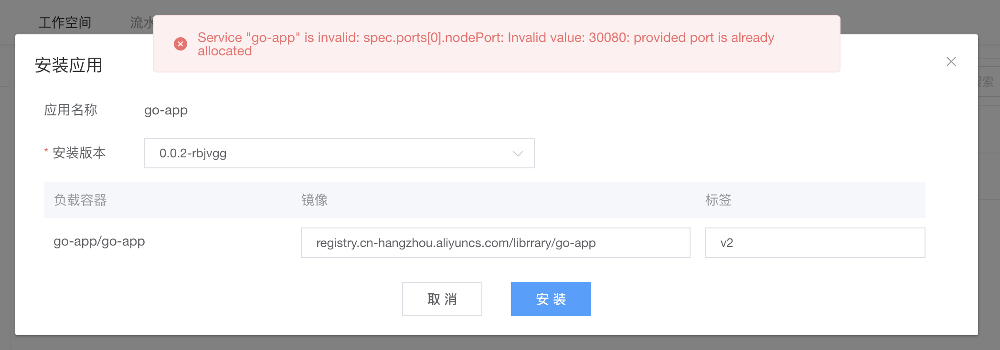

那么，我们可以重新换一个端口，编辑go-app应用，将Service的NodePort端口修改为「30081」。

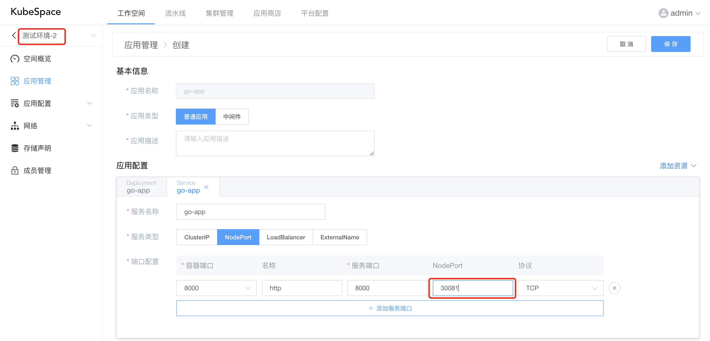

点击「保存」，并将版本号保存为「0.0.3」。

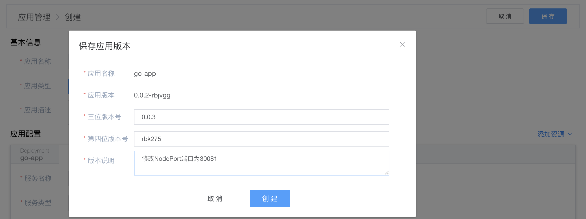

保存之后，安装go-app应用，等go-app状态为「运行中」后，验证应用是否正常运行：

```
curl http://10.240.163.1:30081/v2/current_time
Hello, current time: 2022-05-08 08:44:18
```

OK，收工！

### 交流沟通

如果您在使用过程中，有任何问题、建议或功能需求，欢迎随时跟我们交流或提交[issue](https://github.com/kubespace/kubespace/issues)。

可以使用QQ扫描下面二维码，加入我们的QQ交流群。

