# KubeSpace之应用商店

[KubeSpace](https://kubespace.cn)是一个DevOps以及Kubernetes多集群管理平台。

### 介绍

KubeSpace平台的应用商店内置了丰富的中间件（如mysql、redis等）以及集群组件。来快速支持您的业务部署。

应用商店中的应用底层是通过[Helm Chart](https://helm.sh/docs/chart_template_guide/getting_started/)来实现的。当然，若内置的不满足需求，可以导入自定义应用。

点击每个应用，可以查看该应用的版本列表。

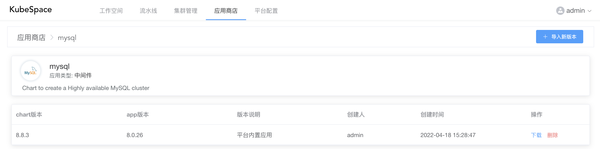

### 导入应用

在我们的「测试环境-1」工作空间中，需要部署一套nginx来负载用户的流量。我们可以导入应用商店中的nginx来快速部署。

进入「测试环境-1」工作空间，左侧导航栏点击「应用」，在列表页，点击「导入应用」按钮。

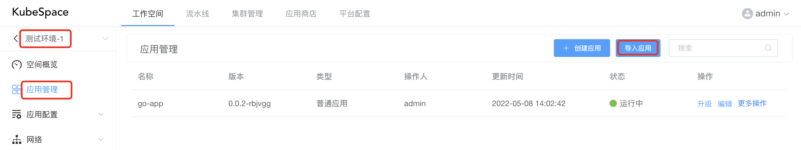

在弹出框中，选择「nginx」应用以及版本。

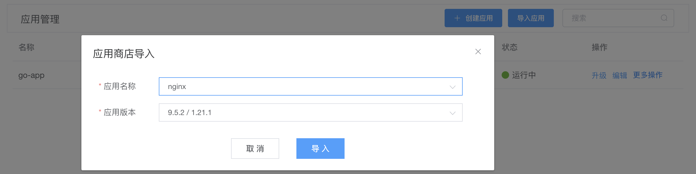

导入之后，需要进行安装，对nginx点击「安装」按钮后，可以修改nginx应用的helm charts中「values」配置。其中可以修改比如副本数、镜像、资源限额、是否开启ingress等配置。

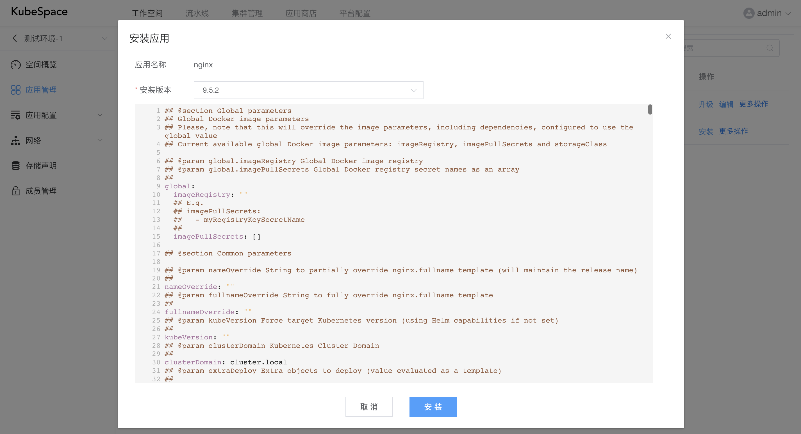

安装之后，等待「nginx」应用运行正常， 进入「nginx」资源详情页面，点击Pod终端。

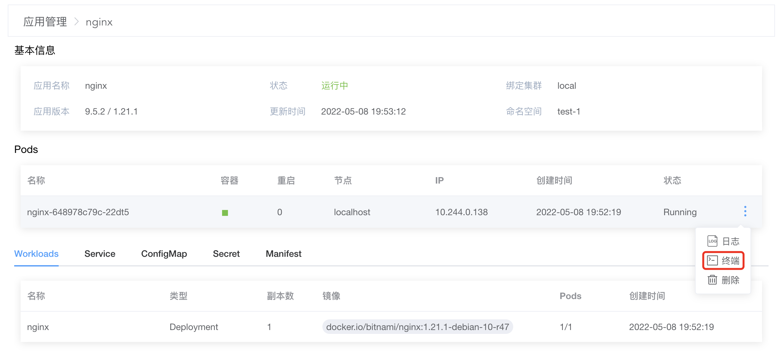

访问该Pod IP，端口为8080。

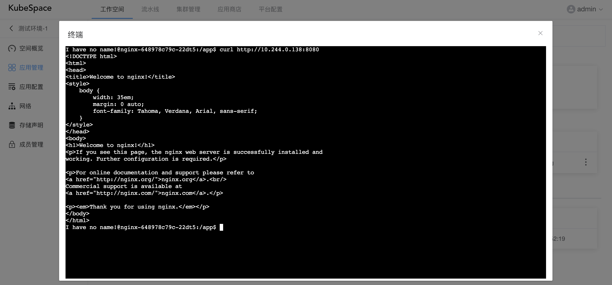

是不是狠方便！！

### 发布到应用商店

现在我们有一个go-app的应用，想让所有人都可以方便的安装部署，那么我们可以将其发布到应用商店。这样，其他人想用的话，可以直接导入对应的工作空间，快速部署到其环境。

在应用列表页，点击go-app的「更多操作」中的「发布」按钮。

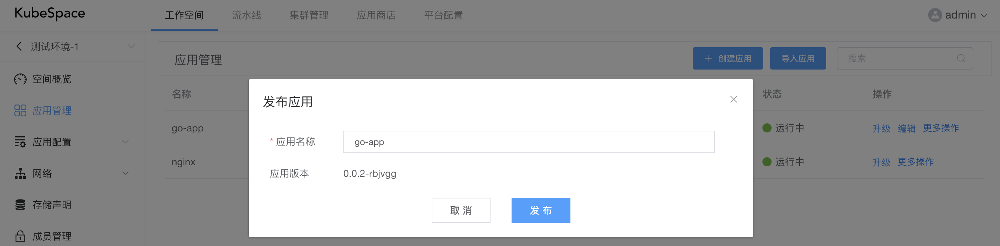

如上，会默认将当前应用的最新版本或运行版本发布到应用商店。

发布之后，会在应用商店看到刚刚发布的go-app应用。

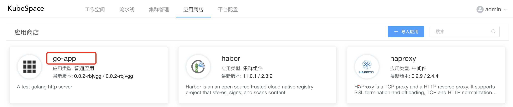

### 导入自定义应用

现在我们有一个已经在使用的helm chart，KubeSpace支持导入自己的helm chart到应用商店。

在应用商店中，点击「+ 导入应用」，在弹出框中，首先需要上传helm chart。

**注意：需上传helm chart的tgz文件。**

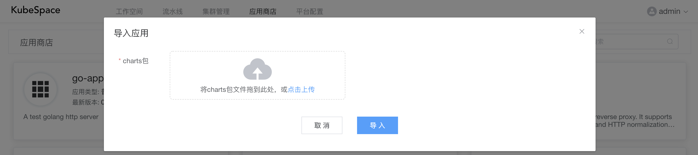

上传chart tgz文件之后，会解析chart中的应用名称、版本以及描述等。

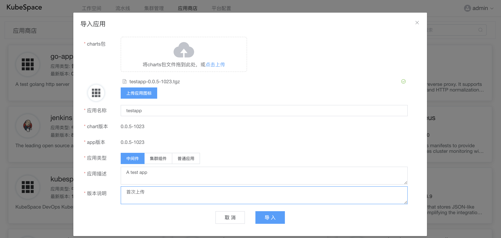

如上，导入了「testapp」这个helm chart，输入该chart的版本说明之后，直接导入即可。

后续我们就可以直接在工作空间中导入部署「testapp」了。

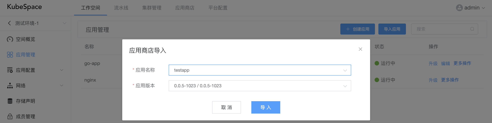

OK，收工！

### 交流沟通

如果您在使用过程中，有任何问题、建议或功能需求，欢迎随时跟我们交流或提交[issue](https://github.com/kubespace/kubespace/issues)。

可以使用QQ扫描下面二维码，加入我们的QQ交流群。

