# KubeSpace最简流水线之构建

[KubeSpace](https://kubespace.cn)是一个DevOps以及Kubernetes多集群管理平台。

### 准备

##### Git代码仓库

现在我们有一个很简单的golang http服务，代码托管在[Github](https://github.com/lzeen/go-app)。

本地启动golang服务，端口为8000：

```
go run main.go
```

请求http://127.0.0.1:8000/current_time返回当前时间：

```
curl http://127.0.0.1:8000/current_time
Hello, current time: 2022-05-08 11:11:33.632898 +0800 CST m=+18.871691849
```

##### Git私钥

一般访问git的私钥在本地文件`~/.ssh/id_rsa`中。若不是该文件，请提前准备好。

### 代码流水线空间

##### 添加密钥

在KubeSpace中的「平台配置」-「密钥管理」中，点击「+ 创建密钥」，添加准备好的git私钥。

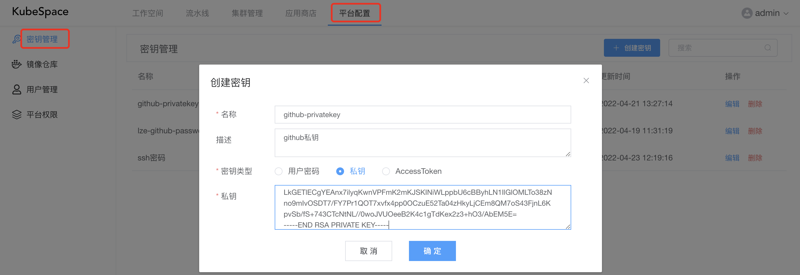

##### 添加镜像仓库

在KubeSpace中的「平台配置」-「镜像仓库」中，点击「+ 添加仓库」，添加镜像仓库，输入用户密码。

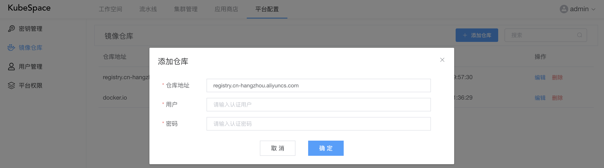

这里，我添加了一个「registry.cn-hangzhou.aliyuncs.com」阿里云的镜像仓库。如果是docker hub，则添加「docker.io」即可。

##### 创建代码空间

在KubeSpace流水线中，点击「+ 创建空间」。


如上，选择代码类型为「GIT」，输入git仓库地址，并选择刚刚添加的密钥。

点击「确定」，创建代码流水线空间之后，默认会创建两条流水线：分支流水线、主干流水线。在两条流水线中都默认包括一个「构建代码镜像」的阶段任务，但是在主干流水线中会多一个「发布」的阶段任务。

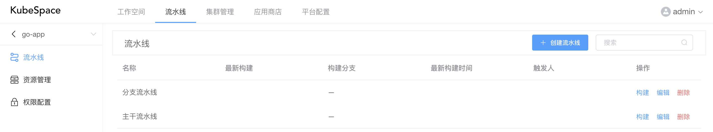

### 构建代码镜像

##### 编辑分支流水线

在流水线列表，点击分支流水线的「编辑」按钮，来配置流水线的阶段任务。

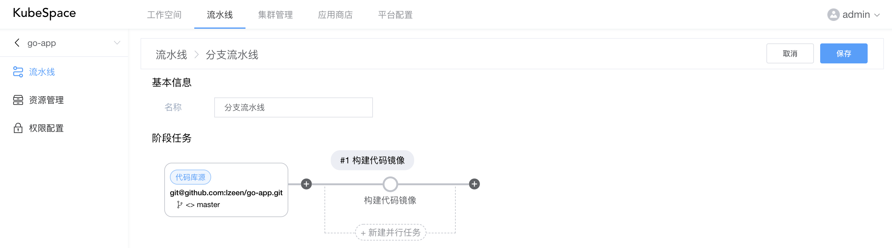

如上，主要包括「基本信息」与「阶段任务」两个部分。

因为当前go-app的代码库只有一个master分支，所以在阶段任务中的「代码库源」中，需要配置触发分支为所有。默认分支流水线是排除master分支的。

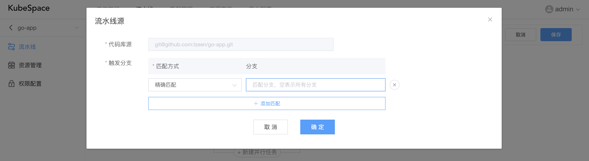

然后，需要修改「构建代码镜像」的任务，点击「构建代码镜像」上方的圆圈进行配置。

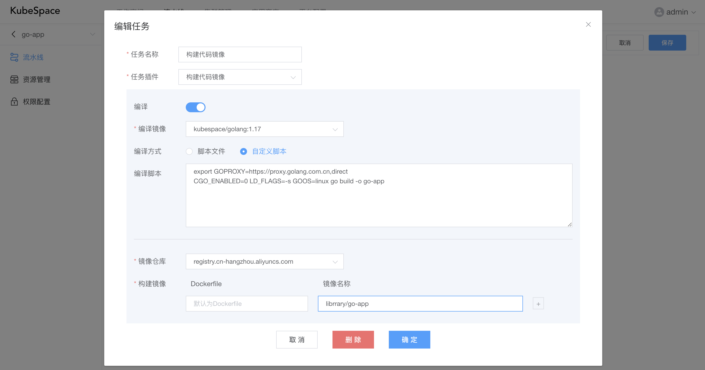

如上，首先对代码进行编译，若不需要编译，则将「编译」取消即可。

若需要编译，则选择编译镜像，KubeSpace默认会自带一些各个语言如golang、node等镜像，如不满足，可以在「资源管理」中进行添加。

然后编译方式分为脚本文件与自定义脚本。脚本文件是在代码库中的编译脚本，需指定相对目录；自定义脚本则在下方的编译脚本中输入编译相关命令即可。

编译完成之后，会对编译后的代码库进行镜像构建。首先需要选择要推送的镜像仓库，这里选择我们刚刚添加的「registry.cn-hangzhou.aliyuncs.com」镜像仓库。

之后输入构建镜像的Dockerfile以及镜像名称。**注意：镜像名称不需要填写标签，在构建镜像时会自动添加动态标签**

##### 执行流水线

对分支流水线编辑完成之后，就可以对执行构建流水线了。

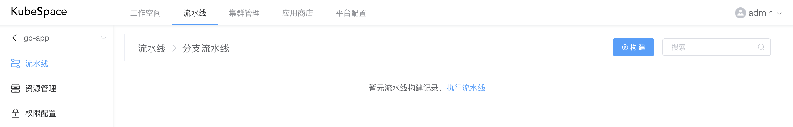

如上，点击「构建」按钮。

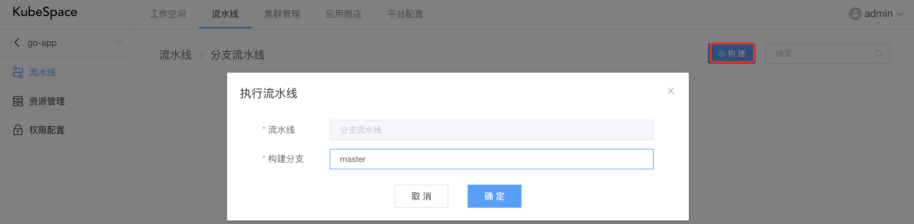

构建分支输入「master」分支，点击「确定」之后，开始执行分支流水线配置的任务。

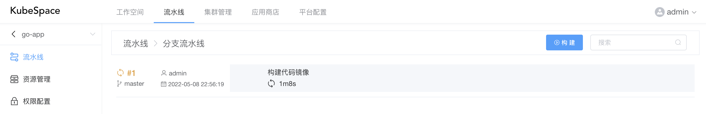

点击「#1」，可以查看当前执行任务的日志以及阶段信息。

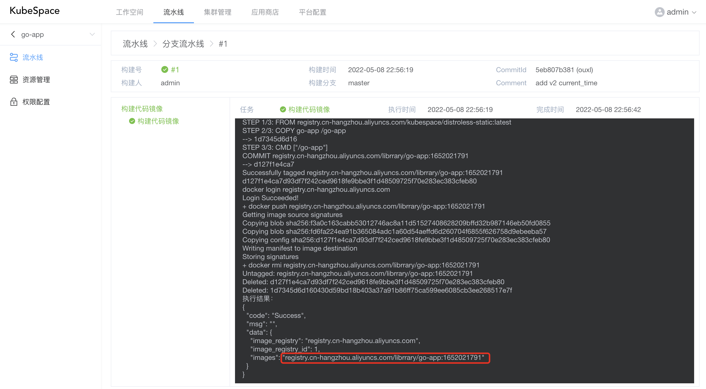

如上，「构建代码镜像」任务执行完成之后，会构建出go-app代码镜像，并推送到镜像仓库。

### 手动升级应用

在流水线构建出代码镜像之后，如上我们构建出go-app的镜像「registry.cn-hangzhou.aliyuncs.com/librrary/go-app:1652021791」。可以在工作空间的应用中，手动对go-app的应用进行镜像升级。

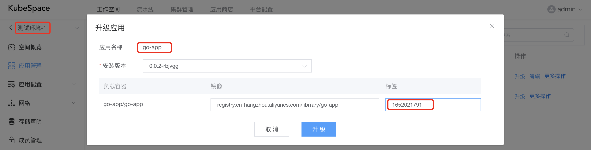

如上，我们对go-app应用的标签升级为流水线构建出来的镜像标签。

点击go-app，可以查看应用的升级过程。

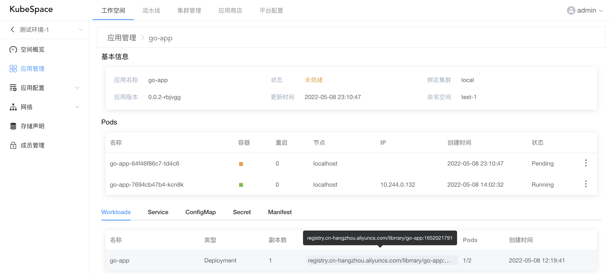

可以看到，当前应用的镜像已经替换为最新的镜像标签，且有新的Pod实例正在创建。

是不是很简单！

OK，收工！

### 交流沟通

如果您在使用过程中，有任何问题、建议或功能需求，欢迎随时跟我们交流或提交[issue](https://github.com/kubespace/kubespace/issues)。

可以使用QQ扫描下面二维码，加入我们的QQ交流群。

