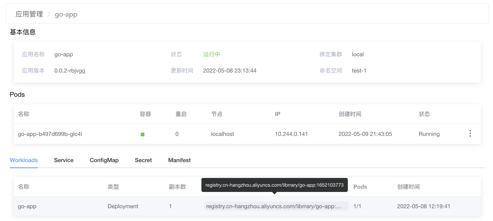

# KubeSpace最简流水线之部署

[KubeSpace](https://kubespace.cn)是一个DevOps以及Kubernetes多集群管理平台。

## 准备

### Git代码仓库

现在我们有一个很简单的golang http服务，代码托管在[Github](https://github.com/lzeen/go-app)。

本地启动golang服务，端口为8000：

```
go run main.go
```

请求 `/v2/current_time` 接口返回当前时间：

```
curl http://127.0.0.1:8000/v2/current_time
Hello, current time: 2022-05-09 21:49:37
```

### 应用

在KubeSpace平台中的「测试环境-1」工作空间中有一个go-app应用。具体可参考[KubeSpace之应用管理]()。

### 分支流水线

在KubeSpace平台中有一个go-app的代码空间以及分支流水线。具体可参考[KubeSpace最简流水线之构建]()。

## 应用自动部署

### 编辑分支流水线

在go-app代码流水线空间中，对分支流水线进行编辑。


在流水线中，点击最右边的「+」，新增一个「部署应用」阶段。


在「部署应用」阶段中新增「部署go-app」任务，其中任务插件选择「应用部署」插件。

在「应用部署」插件中，工作空间选择「测试环境-1」，应用选择「go-app」，以及「是否部署」默认选中。


阶段任务添加完成后，需点击右上角「保存」按钮，对分支流水线进行保存。


### 执行流水线

在分支流水线构建列表，我们可以看到最近一次构建的历史记录，以及构建的代码提交信息。


如上，可以看到最近一次的代码提交id是「5eb807b」。

我们现在对代码又有了一个新的提交，提交id是「83f1fea」。	


在新的提交中，我们将 `/v2/current_time` 接口返回的「Hello」修改为「HELLO」。

```
curl http://127.0.0.1:8000/v2/current_time
HELLO, current time: 2022-05-09 21:49:37
```

现在对分支流水线执行构建，点击「构建」，并输入「master」分支，确定之后，会开始自动执行分支流水线。


如上，可以看到最新的构建代码提交id是「83f1fea」，正是我们最新的提交。而且流水线中也多了一个「部署应用」的阶段。

等待1分钟左右，流水线会自动执行完成。


查看部署应用的任务日志，可以看到会自动将「构建代码镜像」产出的镜像「registry.cn-hangzhou.aliyuncs.com/librrary/go-app:1652103773」更新到「go-app」应用中，并自动进行升级部署。


进入「测试环境-1」工作空间的应用中，查看go-app的应用详情。



如上，可以看到go-app的应用镜像已经更新为「registry.cn-hangzhou.aliyuncs.com/librrary/go-app:1652103773」。

我们访问应用的 `/v2/current_time` 接口，看是否更新成功：

```
curl http://10.244.0.141:8000/v2/current_time
HELLO, current time: 2022-05-09 13:59:17
```

就是如此简单！

OK，收工！

### 交流沟通

如果您在使用过程中，有任何问题、建议或功能需求，欢迎随时跟我们交流或提交[issue](https://github.com/kubespace/kubespace/issues)。

可以使用QQ扫描下面二维码，加入我们的QQ交流群。

