# KubeSpace最简流水线之发布

[KubeSpace](https://kubespace.cn)是一个DevOps以及Kubernetes多集群管理平台。

## 准备

### Git代码仓库

现在我们有一个很简单的golang http服务，代码托管在[Github](https://github.com/lzeen/go-app)。

本地启动golang服务，端口为8000：

```
go run main.go
```

请求 `/v2/current_time` 接口返回当前时间：

```
curl http://127.0.0.1:8000/v2/current_time
HELLO, current time: 2022-05-09 21:49:37
```

### 应用

在KubeSpace中创建一个「生产环境」的工作空间，绑定「local」集群中的「prod」命名空间。


并将「测试环境-1」中的go-app应用克隆到「生产环境」。

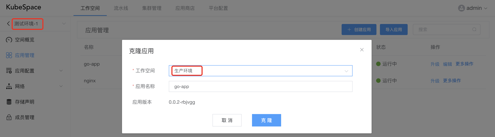

克隆之后，编辑go-app应用，将service中的NodePort端口改为「30088」。

在「生产环境」中安装go-app应用，安装后go-app应用当前的镜像为「registry.cn-hangzhou.aliyuncs.com/librrary/go-app:1652103773」。

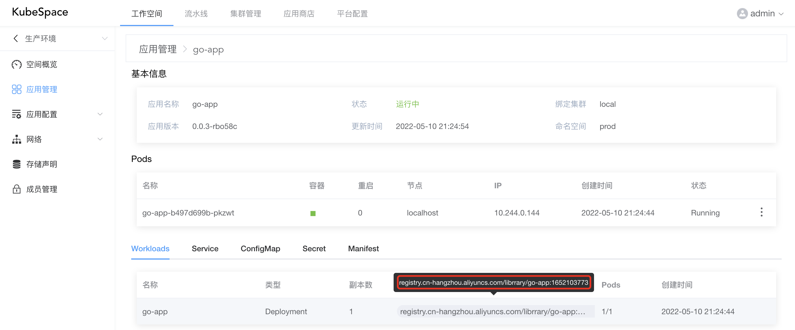

此时，go-app应用运行在「生产环境」中，且服务正常。

```
curl http://10.240.163.1:30088/v2/current_time
HELLO, current time: 2022-05-10 13:29:21
```

### 主干流水线

在KubeSpace平台中有一个go-app的代码空间以及主干流水线。具体可参考[KubeSpace最简流水线之构建]()。

## 发布

### 编辑主干流水线

在go-app代码流水线空间中，对主干流水线进行编辑。

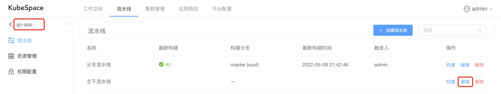

在主干流水线中，代码库源默认触发分支为「master」，且默认有两个阶段「构建代码镜像」以及「发布」。

对「构建代码镜像」中的任务进行修改。

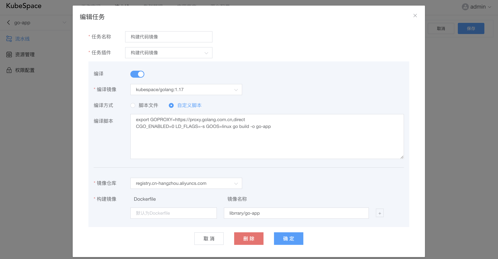

增加阶段「生产环境部署」，并在该阶段下增加「部署go-app」任务。

其中，任务插件选择「应用部署」，工作空间选择「生产环境」，应用选择「go-app」。

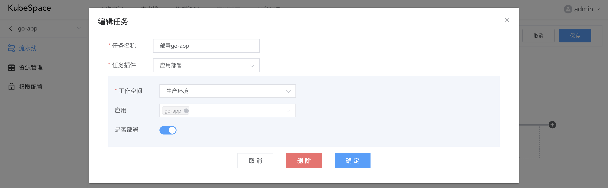

确定之后，点击右上角「保存」对主干流水线进行保存。

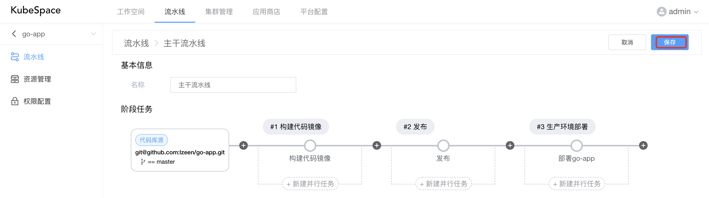

### 执行流水线

主干流水线编辑完成，进入到主干流水线的构建页面。

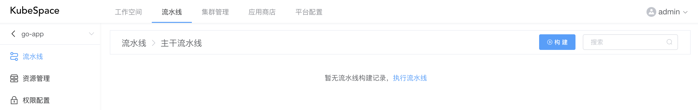

点击「构建」按钮，输入「master」分支之后，会自动开始执行主干流水线。

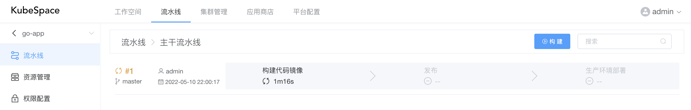

等「构建代码镜像」执行完成之后，在「发布」阶段会暂停执行，后续阶段需要人工触发执行。

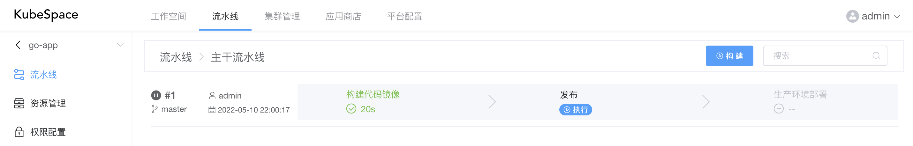

点击「发布」阶段中的「执行」按钮，会要求输入本次发布的版本号，默认第一次发布版本号为「1.0.0」。

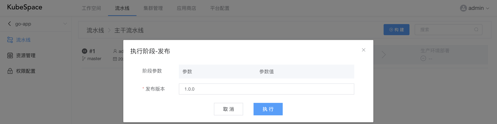

我们默认以「1.0.0」做为本次发布的版本号，点击「执行」按钮，会继续开始后续的阶段执行。

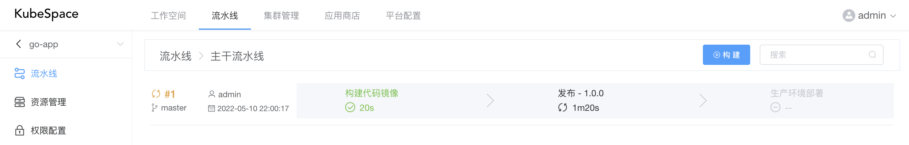

等待1分钟左右，任务会执行成功。

查看发布任务的日志，我们可以看到会对当前代码commit id 「83f1fea」打标签，并对构建出来的镜像打「1.0.0」的标签，并推送镜像到仓库。

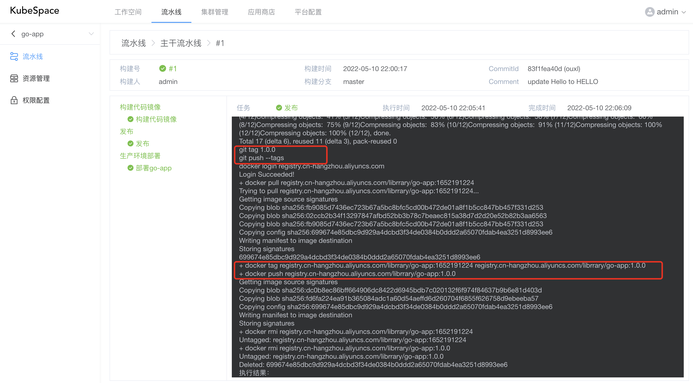

发布完成之后，会自动给代码仓库打上发布的版本号。

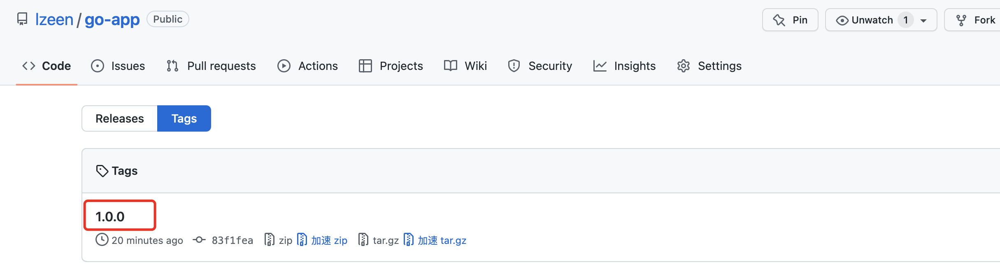

同时，会自动将镜像部署到「生产环境」中的go-app应用。

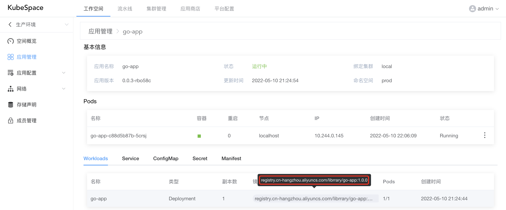

检查一下go-app运行是否正常。

```
curl http://10.244.0.145:8000/v2/current_time
HELLO, current time: 2022-05-10 14:27:57
```

OK，收工！

### 交流沟通

如果您在使用过程中，有任何问题、建议或功能需求，欢迎随时跟我们交流或提交[issue](https://github.com/kubespace/kubespace/issues)。

可以使用QQ扫描下面二维码，加入我们的QQ交流群。

