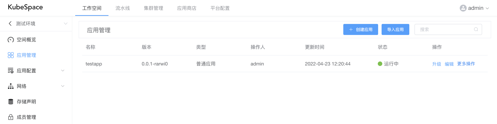
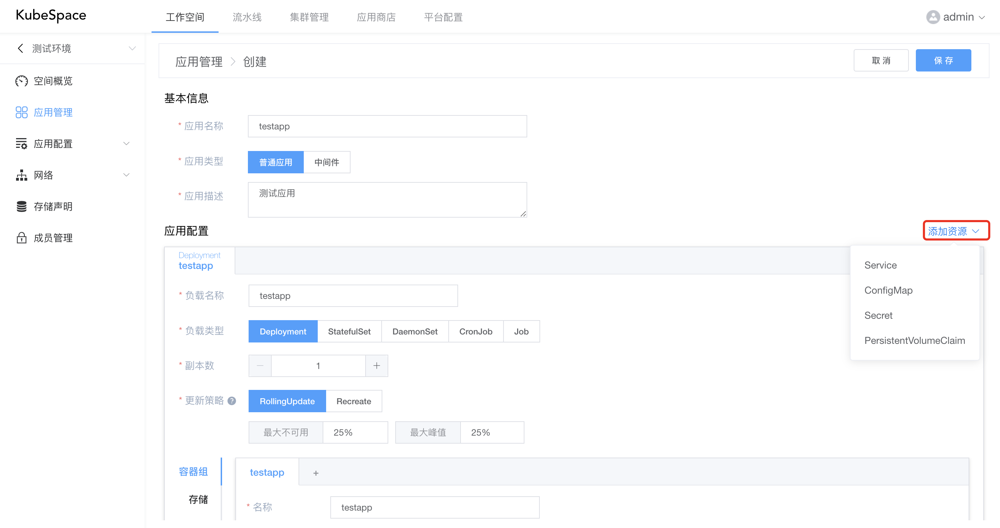
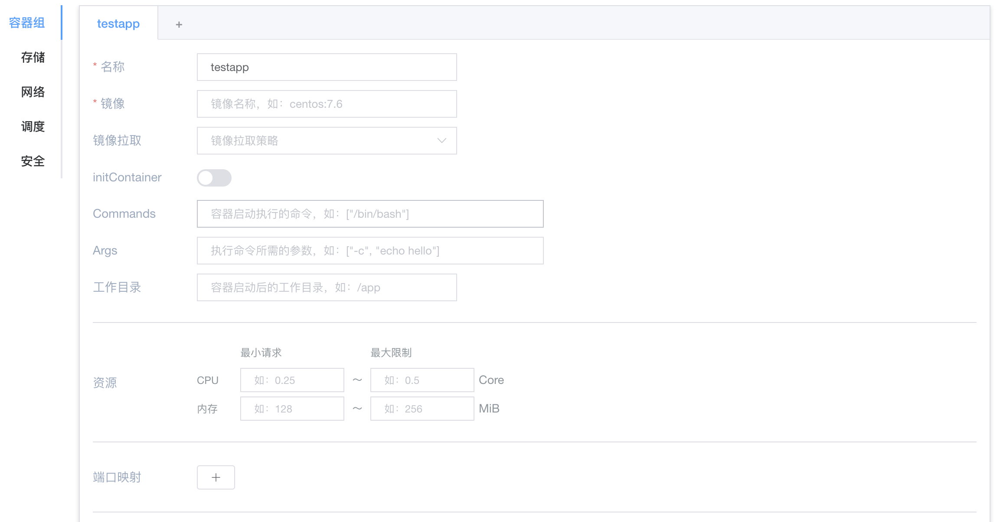
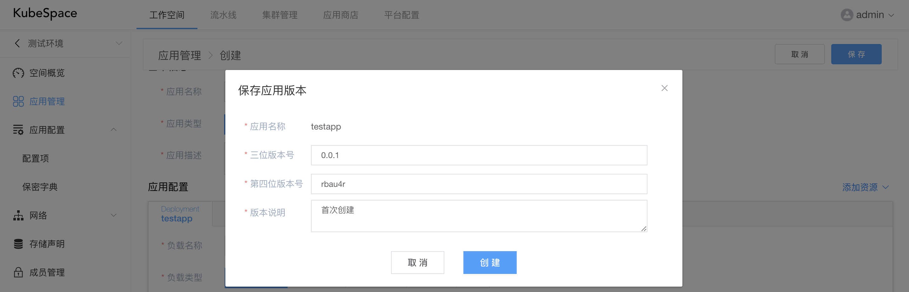
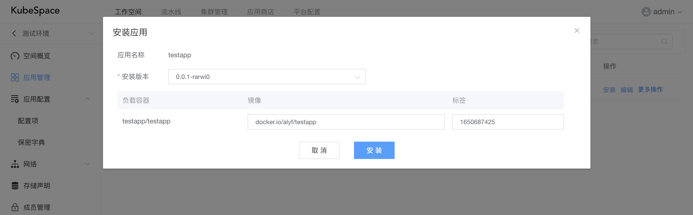
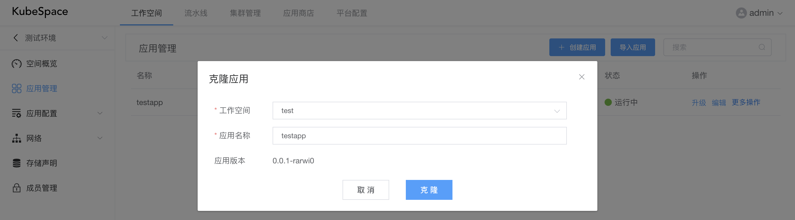

# 应用管理

在工作空间环境中，最主要的是可以对应用进行管理，比如创建、安装、销毁应用等操作。

应用是一组资源（如Deployment、Service、ConfigMap等）的组合。底层实现是通过[helm](https://helm.sh)进行管理的。

### 创建应用

进入工作空间后，点击左侧导航栏的「应用」，点击「创建应用」，进入创建应用页面。

在创建页面中，分为「基本信息」与「应用配置」两部分。

基本信息中包括：

- 应用名称：必填，只能包含小写字母数字以及-和.,数字或者字母开头或结尾；
- 应用类型：必填，包括普通应用、中间件两种类型；
- 应用描述：必填，该应用的基本描述。

应用中默认且必须有一个工作负载，包括Deployment、StatefulSet、DaemonSet、CronJob、Job。

而且，可以在应用中添加其它资源，包括Service、ConfigMap、Secret、PVC。

在工作负载中，主要包括容器组、存储、网络、调度、安全等配置。

- 容器组：可以添加多个容器，容器中包括镜像、启动命令、资源配额等配置；
- 存储：添加外部存储到工作负载，并挂载到容器中，包括PVC、HostPath、EmptyDir、ConfigMap、Secret、NFS、GlusterFS等；
- 网络：配置DNS策略，是否使用宿主机网络、PID，以及自定义域名等；
- 调度：工作负载的调度策略，包括指定节点标签、污点容忍、节点亲和性以及Pod亲和反亲和等；
- 安全：可以对工作负载中的容器限制用户运行以及sysctl配置等。

在基本信息以及应用配置完成之后，点击「保存」按钮，会弹出保存的应用版本信息。

每次创建或编辑都会生成一个应用版本，可以追溯应用的编辑历史。

### 安装应用

创建应用完成之后，可以对应用进行「安装」操作。

- 安装版本：可以选择当前应用的版本进行安装；
- 镜像：工作负载中容器的镜像，可以在安装时进行修改；
- 标签：镜像对应的标签。

在安装完成之后，可以点击「应用名称」，查看应用中具体资源的详情。

安装之后，会有以下几种状态：

- 未就绪：Pod未全部正常运行，等待Pod全部运行起来；
- 运行中：工作负载中的Pod状态正常；
- 运行故障：Pod在10分钟内未全部运行正常。

### 克隆应用

在应用列表中，可以对应用进行克隆，克隆可以快速将应用部署到其它的工作空间，即另一套环境。

上图将应用「testapp」从「测试环境」 克隆至 「test」工作空间。

克隆之后，默认在新的工作空间，应用状态为「未安装」，需手动进行安装。

### 发布应用

除了可以将应用克隆到其它工作空间，在更多操作中点击「发布」，可以将应用发布到应用商店，供所有工作空间使用。

### 导入应用

点击「导入应用」，可以从应用商店导入应用，快速部署包括Mysql、Redis、Kafka等中间件。