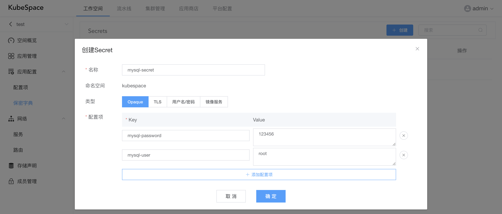
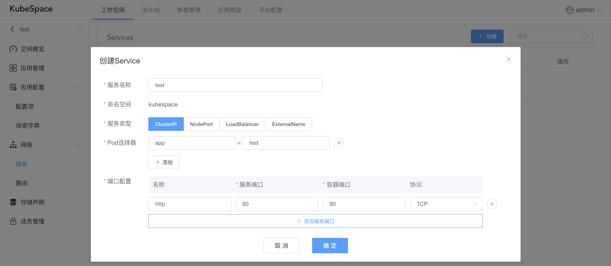
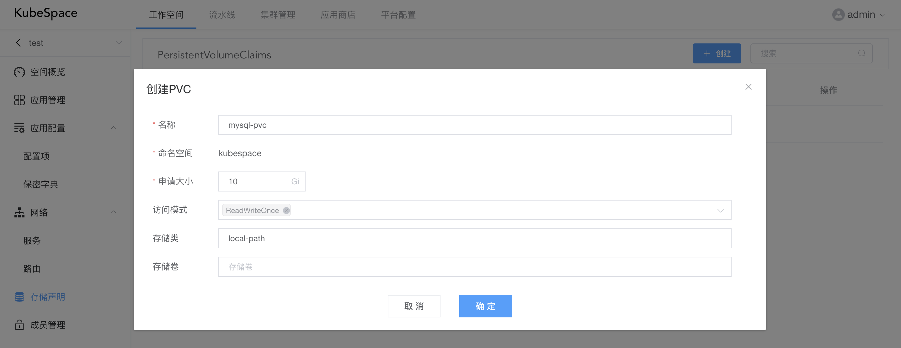

# 空间资源

在工作空间中，可以创建Kubernetes中的命名空间下的资源，包括：ConfigMap、Secret、Service、Ingress、PVC。

### 应用配置

在应用配置中，可以对ConfigMap、Secret进行管理。

### 网络配置

在网络配置中，可以对Service、Ingress进行配置管理。

上图为创建Service的配置内容。

### 存储声明

在工作空间中，可以通过创建PVC存储声明，来给应用中的容器使用挂载外部存储。

