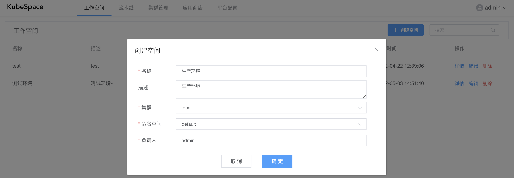

# 工作空间管理

工作空间是一个管理应用以及资源的逻辑概念，工作空间的设计目的如下：

- 以环境（测试环境、生产环境等）为视角，对不同环境中的应用以及资源进行管理，每个环境即一个工作空间；
- 每个工作空间绑定集群中的命名空间，来隔离不同环境的应用以及资源；
- 可以对工作空间中的应用克隆到其它空间，快速启动一个新的工作环境。

### 创建工作空间

在上方导航栏点击「工作空间」，在空间列表页，点击「创建空间」，弹出创建框如下：

其中：

- 名称：工作空间名称；
- 描述：对该空间的描述内容；
- 集群：给当前工作空间绑定的集群；
- 命名空间：对工作空间绑定的集群的命名空间，每个命名空间只能绑定到一个工作空间；
- 负责人：可以对该工作空间指定一个负责人。

